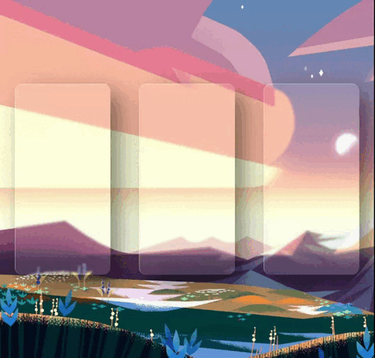

# hello!

i'm practicing HTML, CSS and Javascript - in this project: testing card styling

the vanilla-tilt.js library was used for the reflection and movement animation of the cards
(https://micku7zu.github.io/vanilla-tilt.js/)

     project 07 
    

