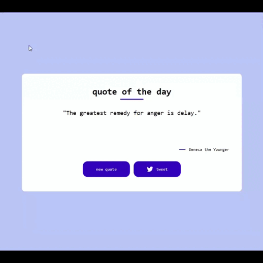

# hello!

i'm practicing HTML, CSS and Javascript - in this project: 
quote generator
 
i used [tweet button](https://developer.twitter.com/en/docs/twitter-for-websites/tweet-button/overview) for quote post function

 
     project 06 
    

